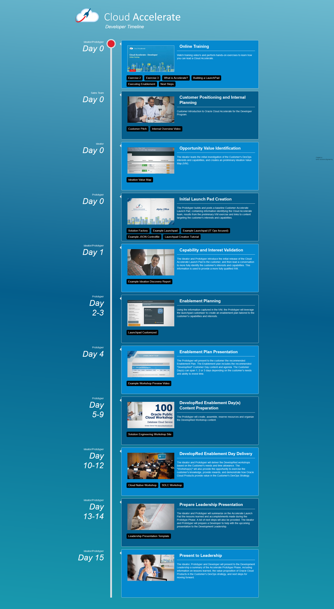

# Timeline
A simple way to visualize roles, activities and assets related to technical events. The project leverages HTML5, JQUERY, JSON along with some creative CSS3 for effects.

## Purpose

As I managed numerous projects that spanned different roles and responsibilities I needed a visual way to communicate at a high level:

- The sequence of events, along with the order of operations, order of role action.

- Quickly communicate the  assets and templates associated with the event and role.

- Enable the information to only be edited by the program manager, devops managers.

Clearly there are project plans, project management tools that communicate detail very well. This web template was design to be simple enough to communicate with sales reps and marketing managers while providing details for technical resources.

## Technology

The webpage is build leveraging HTML5, JQuery, CSS3, JSON and the modernizer javascript library. It includes the ability to play .mp4's in a responsive manner. The background also includes a CSS3 color animation to provide enough movement that the human eyes keep focus on the screen but are not 100% sure why they want to keep focusing. 
